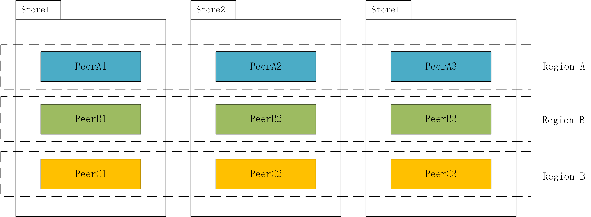
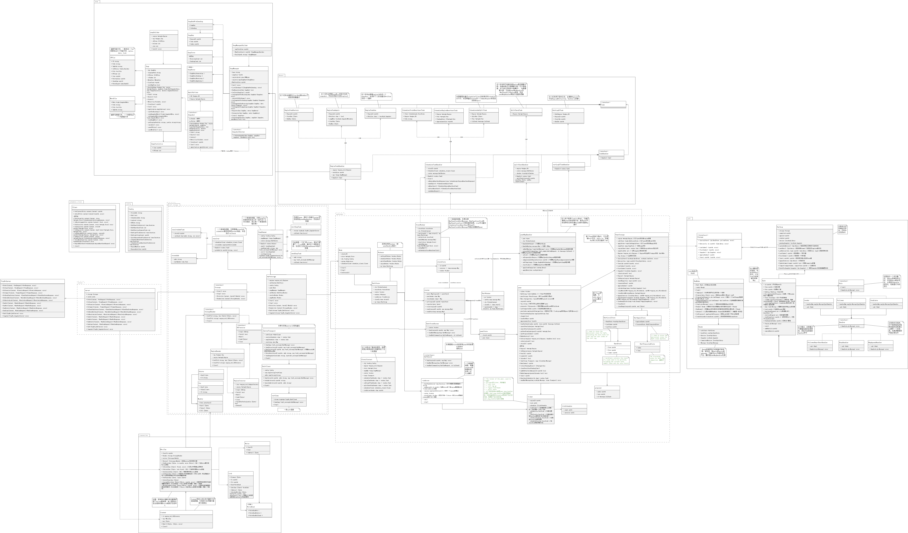

# TinyKV Implement

>  [原来的README文件戳这里](README_ORIGINAL.md)

## 简介


TinyKV是一个容错的、可扩展的持久化KV存储：它通过基于Raft的共识算法实现状态机复制以支持容错；它通过分区(Region)来支持可扩展性；它通过Percolator两阶段提交算法来支持事务。


本项目使用gRPC通信，使用Badger作为内部的单机持久化存储引擎。


项目架构如下图所示


## 进度表


- [x] Project 1: 单机KV
- [x] Project 2: RaftKV
  - [x] Part A: Raft算法模块
  - [x] Part B: 在Raft算法之上构建一个replicated KV服务器
  - [x] Part C: 日志的GC和KV的快照
- [x] Project 3: 分Region的MutiRaftKV
  - [x] Part A: 扩展Raft算法以支持成员变更(加减节点)和领导权变更
  - [x] Part B: 在KV层面上实现成员变更和region分裂
  - [x] Part C: 实现调度器(PD)中的检测分裂和成员变更
- [x] Project 4: 构建在storage层面之上的两阶段提交事务
  - [x] Part A: 在storage层之上实现MVCC的API
  - [x] Part B: 在server层实现事务API
  - [x] Part C: 在server层实现另一些事务API


## 词汇表


在实际介绍架构之前，需要先解释几个名词





- `Store`：也可以称为`Node`，代表一个实际的服务器。
- `Region`：分区，因为要支持可扩展性，每个Region都对应一个键值范围。它是一个跨服务器的概念。
- `Peer`：对等体，指的是单个`Store`上负责某个`Region`的Raft状态机


## 架构与分层


项目包图如下所示


由图可知，项目大体分为4层

- `server`层

- `raftStorage`层
- `raftStore`层
- `raft`层


每个包的大体职责如下

- `server`包：提供TinyKV的对外服务
- `transaction`包：通过`storage`包提供的存储API实现了一个两阶段提交算法。
- `raft_storage`包：它提供了简单的存储API，比如`Write`、`Reader`。接口如代码清单1所示
- `raft_store`包：它实际管理store以及store上的多个raft peer。
- `raft`包：raft算法的实际实现
- `engine`包：单机的基于CF（列族）的KV持久化引擎
- `raft_client`包：负责与其他RaftStore通信
- `scheduler_client`包：负责与scheduler通信
- `snap`包：负责快照的创建、应用、发送、接收等操作
- `runner`包：本层中有许多以独立线程形式运行的负责各种任务的worker。许多耗时或者对实时性要求不高的操作会移到worker中去做。


> 代码清单1: storage层接口

```go
type Storage interface {
	Start() error
	Stop() error
	Write(ctx *kvrpcpb.Context, batch []Modify) error
	Reader(ctx *kvrpcpb.Context) (StorageReader, error)
}

type StorageReader interface {
	// When the key doesn't exist, return nil for the value
	GetCF(cf string, key []byte) ([]byte, error)
	IterCF(cf string) engine_util.DBIterator
	Close()
}
```


## 类图


详细类图如下

看不清可以点这个[svg链接](doc/imgs/class.svg) 

这里也提供要给[vsdx版本](doc/imgs/class.vsdx)的，需要用visio打开




## 多线程


在实际分析线程之前，首先看看项目中`worker`类的设计


```go
type TaskStop struct{}

type Task interface{}

type Worker struct {
	name     string
	sender   chan<- Task
	receiver <-chan Task
	closeCh  chan struct{}
	wg       *sync.WaitGroup
}

type TaskHandler interface {
	Handle(t Task)
}

type Starter interface {
	Start()
}

func (w *Worker) Start(handler TaskHandler) {
	w.wg.Add(1)
	go func() {
		defer w.wg.Done()
		if s, ok := handler.(Starter); ok {
			s.Start()
		}
		for {
			Task := <-w.receiver
			if _, ok := Task.(TaskStop); ok {
				return
			}
			handler.Handle(Task)
		}
	}()
}
```

> 代码清单2: worker架构


简单来说，worker是个异步的任务执行框架：worker会开一个单独的线程，不断地从channel中接收其他线程传过来的任务，然后调用`handler.Handle`来处理这个任务。


在本项目中，除了grpc使用的处理请求的线程池之外，其他的线程都是按照worker框架的形式来工作的。


大概有这些worker

- `tickerDriver`: 一个单独的线程，它定期`tick`一下来推动逻辑时钟

- `raftWorker`: 它负责推动单个`peer`的`raft`状态机，处理各种`raft`消息，持久化`raft`日志，并通过`transport`发送`raft`消息。
- `storeWorker`: 一个单独的线程，负责处理`MsgTypeStoreRaftMessage`、`MsgTypeStoreTick`和`MsgTypeStoreStart`三种类型的消息。`tick`可以触发`SchedulerStoreHeartBeat`和`SnapGC`。`MsgTypeStoreRaftMessage`可能会创建新的`peer`
- `snapWorker`: 它负责`snapShot`的发送和接收工作，因为快照文件通常比较大，都是单独在这个线程中做处理
- `resolveWorker`: 它负责从`scheduler`获取每个`store`的实际`socket`地址
- `regionTaskWorker`: 它负责region层面的任务，包括键值对的清理任务、快照的应用任务、快照的生成任务
- `schdulerTaskWorker`: 它负责需要与`scheduler`交互的任务，包括发送心跳任务、请求分裂任务
- `splitCheckWorker`：这个任务用于检查当前`Region`是否需要分裂，如果体积过大就需要分裂（它只是检查，并不进行实际的分裂操作），如果需要分裂，它会给`peerMsgHandler`发`MsgTypeSplitRegion`消息，然后`peerMsgHandler`再执行后面的逻辑
- `raftLogGCWorker`: 这个任务用于回收日志，会清除`RegionId`对应`Region`的`[StartIdx, EndIdx)`上的键


其中最重要的`worker`就是`raftWorker`。它负责创建`peerMsgHandler`，来根据外界的请求更改`peer`、`raft`状态机内部的状态，并且通过`channel`发送任务给其他`worker`执行。如代码清单2所示

```go
// run runs raft commands.
// On each loop, raft commands are batched by channel buffer.
// After commands are handled, we collect apply messages by peers, make a applyBatch, send it to apply channel.
// run 运行 raft 命令
// 在一次循环中, raft命令被channel buffer给batched
// 当命令被处理, 我们从peers中收集apply msg, 创建要给applyBatch, 并且把它发送给apply信道
func (rw *raftWorker) run(closeCh <-chan struct{}, wg *sync.WaitGroup) {
	defer wg.Done()
	var msgs []message.Msg
	for {
		// 清空msgs
		msgs = msgs[:0]
		select {
		// 当closeCh发来了消息就退出这个run
		case <-closeCh:
			return
		// 	当raftCh发来了消息就把消息加到msg里面
		case msg := <-rw.raftCh:
			msgs = append(msgs, msg)
		}
		// 看看rw.raftCh里面积压了多少消息
		pending := len(rw.raftCh)
		// 把积压的消息全都装到msg里面
		for i := 0; i < pending; i++ {
			msgs = append(msgs, <-rw.raftCh)
		}
		// 造一个空map
		peerStateMap := make(map[uint64]*peerState)
		// 遍历msgs
		for _, msg := range msgs {
			// 根据msg中的RegionID来获取peerState
			peerState := rw.getPeerState(peerStateMap, msg.RegionID)
			// 没有获取到就接着处理下一条消息
			if peerState == nil {
				continue
			}
			// 新建一个PeerMsgHandler并且调用它的HandleMsg来处理消息
			newPeerMsgHandler(peerState.peer, rw.ctx).HandleMsg(msg)
		}
		// 遍历peerStateMap, 也就是刚才处理过消息的peerState, 处理RaftReady
		for _, peerState := range peerStateMap {
			// 新建一个PeerMsgHandler并且调用它的HandleRaftReady来处理RaftReady
			newPeerMsgHandler(peerState.peer, rw.ctx).HandleRaftReady()
		}
	}
}
```

> 代码清单3, raftWorker


## 举个栗子


先占个坑