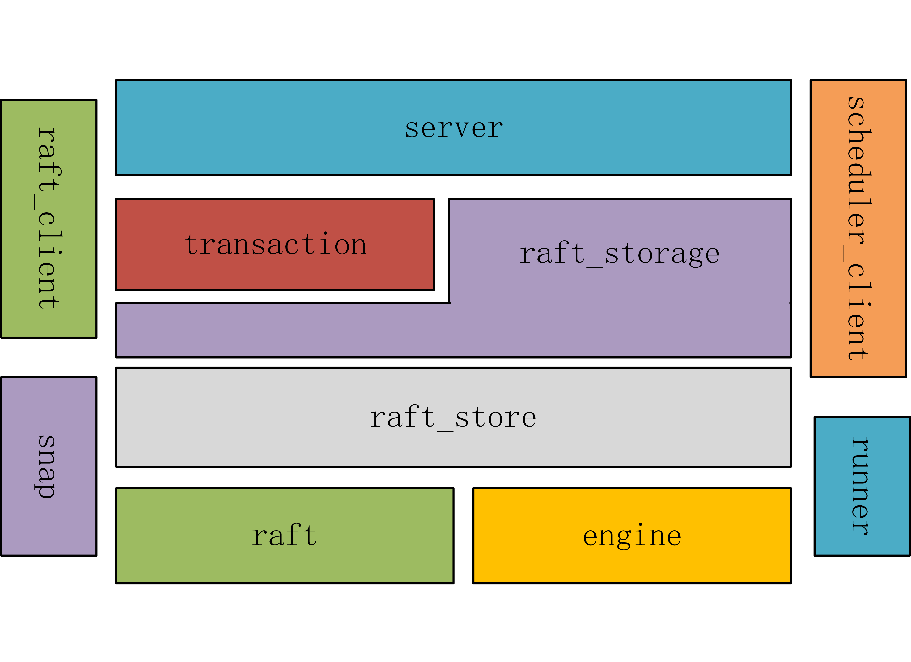

# TinyKV Implement


## 简介


TinyKV是一个容错的、可扩展的持久化KV存储：它通过基于Raft的共识算法实现状态机复制以支持容错；它通过分区(Region)来支持可扩展性；它通过Percolator两阶段提交算法来支持事务。


本项目使用gRPC通信，使用Badger作为内部的单机持久化存储引擎。


项目架构如下图所示


## 进度表


- [x] Project 1: 单机KV
- [x] Project 2: RaftKV
  - [x] Part A: Raft算法模块
  - [x] Part B: 在Raft算法之上构建一个replicated KV服务器
  - [x] Part C: 日志的GC和KV的快照
- [x] Project 3: 分Region的MutiRaftKV
  - [x] Part A: 扩展Raft算法以支持成员变更(加减节点)和领导权变更
  - [x] Part B: 在KV层面上实现成员变更和region分裂
  - [x] Part C: 实现调度器(PD)中的检测分裂和成员变更
- [x] Project 4: 构建在storage层面之上的两阶段提交事务
  - [x] Part A: 在storage层之上实现MVCC的API
  - [x] Part B: 在server层实现事务API
  - [x] Part C: 在server层实现另一些事务API


## 词汇表


在实际介绍架构之前，需要先解释几个名词


- `Store`：也可以称为`Node`，代表一个实际的服务器。
- `Region`：分区，因为要支持可扩展性，每个Region都对应一个键值范围。它是一个跨服务器的概念。
- `Peer`：对等体，指的是单个`Store`上负责某个`Region`的Raft状态机


## 架构与分层


项目包图如下所示



由图可知，项目大体分为4层

- `server`层

- `raftStorage`层
- `raftStore`层
- `raft`层


每个包的大体职责如下

- `server`包：提供TinyKV的对外服务
- `transaction`包：通过`storage`包提供的存储API实现了一个两阶段提交算法。
- `raft_storage`包：它提供了简单的存储API，比如`Write`、`Reader`。接口如代码清单1所示
- `raft_store`包：它实际管理store以及store上的多个raft peer。
- `raft`包：raft算法的实际实现
- `engine`包：单机的基于CF（列族）的KV持久化引擎
- `raft_client`包：负责与其他RaftStore通信
- `scheduler_client`包：负责与scheduler通信
- `snap`包：负责快照的创建、发送、接收等操作
- `runner`包：本层中有许多以独立线程形式运行的负责各种任务的worker。许多耗时或者对实时性要求不高的操作会移到worker中去做。


> 代码清单1: storage层接口

```go
type Storage interface {
	Start() error
	Stop() error
	Write(ctx *kvrpcpb.Context, batch []Modify) error
	Reader(ctx *kvrpcpb.Context) (StorageReader, error)
}

type StorageReader interface {
	// When the key doesn't exist, return nil for the value
	GetCF(cf string, key []byte) ([]byte, error)
	IterCF(cf string) engine_util.DBIterator
	Close()
}
```


## 线程安全性


先开个坑


## 类图


详细类图如下

看不清可以点这个[svg链接](doc\imgs\class.svg) 

这里也提供要给[vsdx版本](doc\imgs\class.vsdx)的，需要用visio打开


## 举个栗子


先开个坑